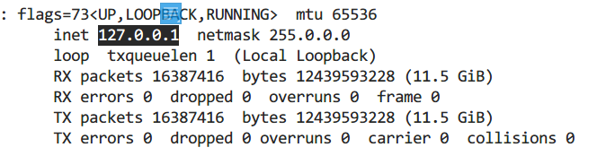

**主要角色**
李密：净
 王伯党：老生
 李世民：小生
 李渊：外
 河阳公主：旦

《双投唐》俞世龙饰王伯党、裘世戎饰李密

**情节**
隋末群雄并起，纷纷割据，人才济济，初以瓦岗寨为最盛。李密主之，既而人心离叛，群雄多去密投唐。瓦岗渐失败，李密势日孤。所未去者王伯党一人而已。王伯党见李密兵微将寡，数为唐困，知大势已去，负隅无益，因劝李密降唐。李密恐唐不纳，反见辱，因先使王伯党往探李世民意。李渊父子至，悉李密有降意，甚喜，许以王爵，并赐公主为李密妻。王伯党复李密后，遂同投大唐。路遇李世民打围，拾得李世民射死之雁，借此进见。李世民引二人回见其父，厚待李密，俱如前约。在唐之待李密，固云厚矣，而李密终以为寄人篱下，不若独树一帜。悔念一萌，叛心顿起，酒后与公主商酌起事，公主不从，旋手刃之。王伯党闻悉大惊，深怪李密作事孟浪，遂劝速逃，己愿护之同行。李密遂夤夜出城，离城不远，而李世民已率追兵至矣。二人至断密涧，恐被擒受辱，遂自刎而死。王伯党可谓忠于李密矣，惜其择主未当，而不得善终也。

**根据《戏考》第四册整理**

**录入：[lans](http://scripts.xikao.com/search?q=typist:lans)**

------

**全剧剧本：PDF 格式**

[阅读](http://scripts.xikao.com/plays/pdf/01004010_双投唐.pdf) （463.54 KB）

------

**全剧剧本：纯文本格式**

【第一场】

（四白龙套同上，王伯党上。）

王伯党　　（念）　　　　　习就百步箭穿杨，一片忠心保瓦岗。

　　　　　（白）　　　　　俺，姓王名勇，字伯党。奉了大王之命，追赶徐勣、魏征。赶到三岔路口，念在贾家楼前结拜，将他二人释放，不免回山朦胧启奏。

　　　　　　　　　　　　　众喽兵，回山去者。

（王伯党、四白龙套同下。）

【第二场】

（四太监同上，李密上。）

李密　　　（西皮快板）　　瓦岗寨上杀气飘，

　　　　　　　　　　　　　密密层层摆枪刀。

　　　　　　　　　　　　　闲来山前摆观花草，

　　　　　　　　　　　　　闷在宫中乐逍遥。

　　　　　　　　　　　　　将身且在我的莲花岛，

　　　　　　　　　　　　　王贤弟回来问根苗。

（四白龙套引王伯党同上。）

王伯党　　（西皮摇板）　　来在瓦岗下虎豹，

　　　　　　　　　　　　　见了大王把令交。

（四白龙套同下。）

王伯党　　（白）　　　　　参见大王。伯党交令。

李密　　　（白）　　　　　贤弟少礼。请坐。

王伯党　　（白）　　　　　谢座。

李密　　　（白）　　　　　命你追赶徐勣、魏征，可曾赶上？

王伯党　　（白）　　　　　他二人去远，追赶不上，特地回山交令。

李密　　　（白）　　　　　哪里是追赶不上，分明念在贾家楼前结拜，将他二人放走，回来蒙哄孤家，是与不是？

王伯党　　（白）　　　　　大王，

　　　　　（西皮快三眼）　大王说话太痴迷，

　　　　　　　　　　　　　细听伯党把话提：

　　　　　　　　　　　　　三十六人曾结义，

　　　　　　　　　　　　　生死相交永不离。

　　　　　　　　　　　　　二劫皇杠把祸起，

　　　　　　　　　　　　　大反山东惹是非。

　　　　　（西皮快板）　　王勇单人把唐抵，

　　　　　　　　　　　　　秦琼匹马取金堤。

　　　　　　　　　　　　　夜夺瓦岗非容易，

　　　　　　　　　　　　　三月三日拜帅旗。

　　　　　　　　　　　　　程咬金有福登龙位，

　　　　　　　　　　　　　兵多将广人马齐。

　　　　　　　　　　　　　自从大王到此地，

　　　　　　　　　　　　　锦绣江山化灰泥。

　　　　　　　　　　　　　恨飞鼠盗去仓粮米，

　　　　　　　　　　　　　满山的喽罗似鹊飞。

　　　　　　　　　　　　　众家弟兄丧了队，

　　　　　　　　　　　　　一个东来一个西。

　　　　　　　　　　　　　只剩下王勇来保你，

　　　　　　　　　　　　　反说为臣把君欺。

　　　　　　　　　　　　　倘若哪国刀兵起，

　　　　　　　　　　　　　祸到临头悔不及。

李密　　　（白）　　　　　呀！

　　　　　（西皮摇板）　　王贤弟说话倒有理。

　　　　　（西皮快板）　　问得孤王无话提。

　　　　　　　　　　　　　李密忙离我的金交椅，

　　　　　　　　　　　　　背转身来自猜疑：

　　　　　　　　　　　　　孤王有道天心顺，

　　　　　　　　　　　　　满山的喽罗人马齐。

　　　　　　　　　　　　　我好比困龙遭虾戏，

　　　　　　　　　　　　　败阵的凤凰不如鸡。

　　　　　　　　　　　　　扭回头来叫贤弟，

　　　　　　　　　　　　　孤王的言来细听端的：

　　　　　　　　　　　　　你本是堂堂奇男子，

　　　　　　　　　　　　　莫做三心二意的。

王伯党　　（西皮快板）　　说什么三心二意的，

　　　　　　　　　　　　　为臣怎敢把君欺。

　　　　　　　　　　　　　我若保主有假意，

　　　　　　　　　　　　　气化清风肉化泥。

李密　　　（西皮快板）　　好一个忠良王贤弟，

　　　　　　　　　　　　　亚赛当年介子推。

　　　　　　　　　　　　　孤王要把良心昧，

　　　　　　　　　　　　　乱箭攒身死不回。

　　　　　（白）　　　　　贤弟，瓦岗已散，究要重整瓦岗才是。

王伯党　　（白）　　　　　瓦岗已散，难以重整。保定大王，前去降唐。

李密　　　（白）　　　　　唐童与孤有南牢之仇，不去逃生，反去送死！

王伯党　　（白）　　　　　愿保大王无事。

李密　　　（白）　　　　　如此，走。

王伯党　　（白）　　　　　这样不能前去。

李密　　　（白）　　　　　要怎样前去？

王伯党　　（白）　　　　　换了随衣小帽，方可前去。

李密　　　（白）　　　　　这身荣耀，叫孤怎样舍得？

王伯党　　（白）　　　　　事到如今，舍不得也要舍。

李密　　　（白）　　　　　看衣裳换。

（李密换衣。〖牌子〗。）

李密　　　（白）　　　　　贤弟替孤传令。

王伯党　　（白）　　　　　遵命。

　　　　　　　　　　　　　下面听者：大王前去降唐，你等愿随就随，不愿随者，大家散去。

（四太监同下。）

王伯党　　（白）　　　　　传令已毕。

李密　　　（白）　　　　　贤弟与孤带马。

王伯党　　（白）　　　　　来也。

李密　　　（西皮原板）　　在头上取下了我的飞龙帽，

　　　　　　　　　　　　　在身上脱去了我的衮龙袍。

　　　　　　　　　　　　　勒住了马头用目觑，

　　　　　　　　　　　　　锦绣江山化灰泥。

　　　　　　　　　　　　　舍不得瓦岗风景地，

　　　　　　　　　　　　　舍不得瓦岗人马齐。

　　　　　　　　　　　　　此一去降唐好一比，

　　　　　　　　　　　　　虎落在平阳被犬欺。

王伯党　　（西皮快板）　　大王不要暗着急，

　　　　　　　　　　　　　伯党言来听端的：

　　　　　　　　　　　　　江山自有兴和废，

　　　　　　　　　　　　　哪个男儿不受欺？

　　　　　　　　　　　　　改邪归正投唐去，

　　　　　　　　　　　　　青史名标万古提。

李密　　　（西皮快板）　　怕只怕唐童把仇记，

　　　　　　　　　　　　　笼中之鸟怎能飞？

王伯党　　（西皮快板）　　杀身大祸臣愿抵，

　　　　　　　　　　　　　愿保大王挂紫衣。

（李密、王伯党同下。）

【第三场】

（李世民引四龙套同上。）

李世民　　（西皮摇板）　　少小英雄胆气豪，

　　　　　　　　　　　　　黄石略法吕望韬。

　　　　　　　　　　　　　为将名图垂千古，

　　　　　　　　　　　　　替主阵前血染刀。

　　　　　（念）　　　　　曾记当年战洛阳，可恨李密西魏王。将孤囚禁南牢内，皇兄改本转回乡。

　　　　　（白）　　　　　小王李世民。可恨杨广无道，国乱民愁，且喜父王驾坐长安，倒也安然。几载干戈宁静，还有几路狼烟未灭，是小王放心不下，故尔在父王台前讨下旨意，统领人马，往银弓山兴围打猎，二来代访贤臣。

　　　　　　　　　　　　　内侍，人马可齐？

内侍　　　（白）　　　　　俱已齐备。

李世民　　（白）　　　　　起驾银弓山。

内侍　　　（白）　　　　　领旨。

李世民　　（白）　　　　　撒下围场。

（众人同下。）

【第四场】

李世民　　（内西皮导板）　将人马扎在银弓山，

（李世民、四龙套同上。）

李世民　　（西皮摇板）　　刀枪剑戟似秋霜。

　　　　　　　　　　　　　五色旌旗空中荡，

　　　　　　　　　　　　　强弓硬弩摆成行。

　　　　　　　　　　　　　南边飞来一群雁，

　　　　　　　　　　　　　字字行行闹嚷嚷。

　　　　　　　　　　　　　小王搭上珠红箭，

　　　　　　　　　　　　　对准鸿雁撒上弦。

内侍　　　（白）　　　　　启千岁：带箭而逃。

（李世民追下。）

【第五场】

李密　　　（内白）　　　　马来。

（李密、王伯党同上。）

李密　　　（西皮摇板）　　昔日螳螂取独蝉，

王伯党　　（西皮摇板）　　偶遇黄雀在道边。

李密　　　（西皮摇板）　　黄雀又被金弹打，

王伯党　　（西皮摇板）　　打弹之人被虎餐。

李密　　　（西皮摇板）　　看来一报还一报，

王伯党　　（西皮摇板）　　仇报仇来冤报冤。

李密　　　（西皮摇板）　　勒住丝缰用目看，

王伯党　　（西皮摇板）　　只见箭雁落马前。

　　　　　（白）　　　　　“西府秦王百发百中”。

李密　　　（白）　　　　　贤弟手拿何物？

王伯党　　（白）　　　　　乃是箭雁，大王请看。

李密　　　（白）　　　　　待孤看来：“西府秦王百发百中”。贤弟，你我拿了这只箭雁，去到前村，沽饮一回。

王伯党　　（白）　　　　　且慢。有了箭雁，就有了进身之策。

李密　　　（白）　　　　　何为进身之策？

王伯党　　（白）　　　　　等那秦王到此，将箭雁献上，岂不是进身之策？

李密　　　（白）　　　　　贤弟，你保得孤王便保，保不得孤王，让孤好跑。

王伯党　　（白）　　　　　愿保大王无事。

李密　　　（白）　　　　　哪里等候？

王伯党　　（白）　　　　　松林等候。

李密　　　（白）　　　　　请。

　　　　　（西皮摇板）　　从空落下雕翎箭，

（李密下。）

王伯党　　（西皮摇板）　　狭路相逢天凑缘。

（王伯党下。）

【第六场】

（李世民、四龙套同上。）

李世民　　（西皮摇板）　　此雁中了雕翎箭，

　　　　　　　　　　　　　百发百中不虚传。

　　　　　　　　　　　　　传旨赶过桃花店，

　　　　　　　　　　　　　不知箭雁落哪边。

（王伯党上。）

李世民　　（白）　　　　　前道因何不行？

王伯党　　（白）　　　　　王勇挡道。

内侍　　　（白）　　　　　王勇挡道。

李世民　　（白）　　　　　人马闪开。

王伯党　　（白）　　　　　参见千岁。

李世民　　（白）　　　　　原来伯党皇兄。不在瓦岗，到此则甚？

王伯党　　（白）　　　　　为臣拾得箭雁，特来献上。

李世民　　（白）　　　　　乃是皇兄之功，收过了。吓，皇兄不在瓦岗扶保李密，来在荒郊何事？

王伯党　　（白）　　　　　臣保定一人，前来降唐。

李世民　　（白）　　　　　但不知是哪一家？

王伯党　　（白）　　　　　西魏王李密。

李世民　　（白）　　　　　何不前来相见？

王伯党　　（白）　　　　　犹恐千岁提起南牢仇恨。

李世民　　（白）　　　　　只要真心归顺，南牢之事一概不提。

王伯党　　（白）　　　　　谢千岁。

李世民　　（白）　　　　　今在何处？

王伯党　　（白）　　　　　现在松林。

李世民　　（白）　　　　　请来相见。

王伯党　　（白）　　　　　遵命。吓，千岁须要言而有信。

李世民　　（白）　　　　　将军吓，

　　　　　（西皮快板）　　皇兄不必细叮咛，

　　　　　　　　　　　　　小王非是等闲人。

　　　　　　　　　　　　　只要真心来归顺，

　　　　　　　　　　　　　我与他皇兄御弟称。

王伯党　　（白）　　　　　谢千岁。

　　　　　（西皮快板）　　好一个仁义二主君，

　　　　　　　　　　　　　他比尧舜胜十分，

　　　　　　　　　　　　　后来若是登九五，

　　　　　　　　　　　　　必定不差半毫分。

　　　　　　　　　　　　　松林内忙把大王请，

（李密上。）

李密　　　（西皮摇板）　　心中恍惚不安宁。

　　　　　（白）　　　　　贤弟可曾见过唐童？

王伯党　　（白）　　　　　也曾见过。

李密　　　（白）　　　　　南牢之仇？

王伯党　　（白）　　　　　一概不究。

李密　　　（白）　　　　　好，带孤上前。

王伯党　　（白）　　　　　且慢。见了唐王，怎么行礼？

李密　　　（白）　　　　　我与他打上一躬，“唐童请了请了！”

王伯党　　（白）　　　　　嗳，他乃一君，你乃一臣，必须下一全礼。

李密　　　（白）　　　　　嗳，他乃一国的王子，想孤在瓦岗寨上，也是一国的王子，叫我与他下上全礼，那是万万不能。

王伯党　　（白）　　　　　你前来作甚？

李密　　　（白）　　　　　前来降唐。

王伯党　　（白）　　　　　却又来！

　　　　　（西皮快板）　　说什么瓦岗你为君，

　　　　　　　　　　　　　说什么低头不拜人。

　　　　　　　　　　　　　上前去施一个君臣礼，

　　　　　　　　　　　　　我保你头戴乌纱入朝门。

李密　　　（西皮二六板）　李密闻言心不准，

　　　　　　　　　　　　　背转身来自思忖。

　　　　　　　　　　　　　想孤在瓦岗多侥幸，

　　　　　　　　　　　　　称孤道寡亚赛个朝庭。

　　　　　　　　　　　　　到如今孤王来归顺，

　　　　　　　　　　　　　反得要屈膝跪他人。

　　　　　　　　　　　　　这才是船到江心，

　　　　　（西皮快板）　　风不顺，

　　　　　　　　　　　　　时衰运败鬼弄人。

　　　　　　　　　　　　　罢罢罢，暂忍我的心头恨，

　　　　　　　　　　　　　慢慢再定巧计生。

　　　　　　　　　　　　　扭回头我对贤弟论，

　　　　　　　　　　　　　孤王言来细听分明：

　　　　　　　　　　　　　自要那唐童不记南牢旧仇恨，

　　　　　　　　　　　　　我跪他一席待怎生。

　　　　　　　　　　　　　王贤弟与孤把路引，

　　　　　　　　　　　　　有罪的李密我来叩见圣明君。

李世民　　（白）　　　　　将军吓！

　　　　　（西皮摇板）　　西魏王不必礼恭敬，

　　　　　　　　　　　　　依礼而代入朝门。

李密　　　（白）　　　　　谢千岁。

　　　　　（西皮摇板）　　人言唐童似尧舜，

王伯党　　（西皮摇板）　　话不虚传果是真。

李密　　　（西皮摇板）　　降唐的事儿心拿稳，

王伯党　　（西皮摇板）　　似狂风吹散了满天云。

李世民　　（白）　　　　　众将官，人马回朝。

（众人同下。）

【第七场】

（四太监引李渊同上。）

李渊　　　（引子）　　　　河清海晏，五谷丰登。

　　　　　（念）　　　　　日出东方捧祥云，笙歌嘹亮来深台。瑶台翡翠飞彩凤，殿用雀东西六龙。

　　　　　（白）　　　　　寡人，神尧高祖李渊，国号武德在位。自太原起圣，受命于天，龙飞凤舞。目今天下升平，所有一十八路反王，年年进贡，岁岁来朝。正是：

　　　　　（念）　　　　　一人有福安天下，万国衣冠贺圣皇。

　　　　　（白）　　　　　内臣，开放龙门。

太监　　　（白）　　　　　领旨。

　　　　　　　　　　　　　万岁有旨：开放龙门。

内侍　　　（内白）　　　　秦王回朝。

太监　　　（白）　　　　　随旨上殿。

李世民　　（内白）　　　　领旨。

（李世民上。）

李世民　　（念）　　　　　兴围打猎事，奏与父皇知。

　　　　　（白）　　　　　儿臣见驾，父皇万岁。

李渊　　　（白）　　　　　皇儿平身。

李世民　　（白）　　　　　万万岁。

李渊　　　（白）　　　　　赐座。

李世民　　（白）　　　　　谢座。

李渊　　　（白）　　　　　皇儿郊外射猎，打得多少飞禽走兽？

李世民　　（白）　　　　　儿臣未曾打得飞禽走兽，收来二家贤臣。

李渊　　　（白）　　　　　可知贤臣姓甚名谁？

李世民　　（白）　　　　　李密、王伯党前来投唐。

李渊　　　（白）　　　　　唔，那李密瓦岗贼寇，从前将皇兄囚禁南牢，孤皇正要兴兵拿他问罪，他今日自投罗网，为何不将他正法？

李世民　　（白）　　　　　若提南牢之事，又恐大事难成。

李渊　　　（白）　　　　　皇儿有理。二人今在何处？

李世民　　（白）　　　　　现在午门。

李渊　　　（白）　　　　　宣他二人上殿。

李世民　　（白）　　　　　父皇有旨：宣王伯党、李密上殿。

李密、

王伯党　　（内同白）　　　领旨。

（李密、王伯党同上。）

李密　　　（念）　　　　　低头入朝门，

王伯党　　（念）　　　　　叩见圣明君。

李密　　　（白）　　　　　臣，李密，

王伯党　　（白）　　　　　臣，伯党，

李密、

王伯党　　（同白）　　　　见驾，吾皇万岁！

李渊　　　（白）　　　　　李密，你可知罪？

李密　　　（白）　　　　　臣知罪，望吾皇开恩。

李渊　　　（白）　　　　　自要你真心归顺，寡人一概不究。暂授魏国公之职，下殿。

李密　　　（白）　　　　　谢万岁！

　　　　　（念）　　　　　暂为鸡鸣客，且做懵懂人。

（李密下。）

李渊　　　（白）　　　　　伯党听封。

王伯党　　（白）　　　　　臣有本启奏。

（〖牌子〗。）

李渊　　　（白）　　　　　皇儿，王伯党奏道：一臣不事二主，情愿服侍李密，不愿为官。如何发落？

李世民　　（白）　　　　　他乃忠义之人，既然不愿为官，父皇还要另加爵赏。

李渊　　　（白）　　　　　王将军已不愿官职，暂住李密门下。日后有功，自有封赠。

王伯党　　（白）　　　　　谢主龙恩。

　　　　　（念）　　　　　伯党生来情性刚，一臣不保二君皇。

（王伯党下。）

李渊　　　（白）　　　　　皇儿，李密为寇多年，野心未定。今来降唐，不可重用，恐有异心。

李世民　　（白）　　　　　启奏父皇：何不将河阳公主许配李密，招为东床驸马，反心自退。

李渊　　　（白）　　　　　寡人有旨：命河阳公主招赘魏国公李密，即刻梳妆，傧相赞礼，退班。

（李渊、李世民同下。）

【第八场】

（四宫女引河阳公主同上。）

河阳公主　（引子）　　　　雨露似天才，夫荣妻贵堪偕。

大太监　　（内白）　　　　驸马回宫。

宫女　　　（白）　　　　　驸马回宫。

（太监引李密同上。）

河阳公主　（白）　　　　　驸马请坐。

（太监下。）

李密　　　（白）　　　　　有坐。

河阳公主　（白）　　　　　驸马今日上朝，我皇伯怎样传旨？

李密　　　（白）　　　　　皇伯传旨下来，山西贼寇造反，命本宫挂帅，前去征剿。

河阳公主　（白）　　　　　不知驸马几时启程？

李密　　　（白）　　　　　明早启程。

河阳公主　（白）　　　　　妾身备得有宴，与驸马饯行。

李密　　　（白）　　　　　有劳公主。

河阳公主　（白）　　　　　宫娥看酒。

李密　　　（西皮原板）　　皇宫内院把宴摆，

　　　　　　　　　　　　　夫妻们对坐饮开怀。

　　　　　　　　　　　　　停杯不饮愁眉带，

　　　　　　　　　　　　　她怎知我心事揣在怀。

河阳公主　（白）　　　　　驸马。

　　　　　（西皮原板）　　琴瑟和调真恩爱，

　　　　　　　　　　　　　夫唱妇随永合谐。

　　　　　　　　　　　　　今日宫中把宴摆，

　　　　　　　　　　　　　驸马因何不开怀？

　　　　　（白）　　　　　驸马为何停杯不饮？

李密　　　（白）　　　　　非是停杯不饮，我有心事在怀。

河阳公主　（白）　　　　　既有心事在怀，何不对妾身讲明。

李密　　　（白）　　　　　这个……耳目甚众。

河阳公主　（白）　　　　　吓，宫娥退下。

（四宫女同允，同下。）

河阳公主　（白）　　　　　驸马请讲。

李密　　　（白）　　　　　公主，想孤在瓦岗寨上，朝朝饮宴，夜夜笙歌，好不快乐人也！

　　　　　（西皮快板）　　非是本宫愁眉带，

　　　　　　　　　　　　　公主听我表心怀：

　　　　　　　　　　　　　瓦岗为王有数载，

　　　　　　　　　　　　　犹如天子坐龙台。

　　　　　　　　　　　　　飞龙帽，头上戴，

　　　　　　　　　　　　　绛黄蟒袍海外来，

　　　　　　　　　　　　　腰束八宝白玉带，

　　　　　　　　　　　　　粉底朝靴踹金阶。

　　　　　　　　　　　　　也有文武参朝拜，

　　　　　　　　　　　　　也有宫娥女裙衩。

　　　　　　　　　　　　　闲来跨马游郊外，

　　　　　　　　　　　　　闷向宫中把宴摆。

　　　　　　　　　　　　　宫娥彩女解龙带，

　　　　　　　　　　　　　三宫六院陪伴我好不快乐哉。

　　　　　　　　　　　　　不幸散了瓦岗寨，

　　　　　　　　　　　　　因此投唐到此来。

　　　　　　　　　　　　　虽蒙唐王恩似海，

　　　　　　　　　　　　　怎及瓦岗快乐哉？

　　　　　　　　　　　　　东床驸马我不爱，

　　　　　　　　　　　　　一心还想坐龙台。

河阳公主　（白）　　　　　呀！

　　　　　（西皮快板）　　听他言来愁眉带，

　　　　　　　　　　　　　背转身来暗思裁：

　　　　　　　　　　　　　皇伯恩义将他待，

　　　　　　　　　　　　　奴家与他配合偕。

　　　　　　　　　　　　　东床驸马他不爱，

　　　　　　　　　　　　　一心只想谋龙台。

　　　　　　　　　　　　　我明明知道装不解，

　　　　　　　　　　　　　假意上前问开怀。

　　　　　（白）　　　　　驸马，听你之言，敢不是要谋我皇伯的龙位么？

李密　　　（白）　　　　　本宫早有此心。公主，你可知皇伯的玉玺今在何处？

河阳公主　（白）　　　　　现在昭阳正院。有了玉玺，你便怎么讲？

李密　　　（白）　　　　　公主盗来玉玺，本宫征剿山西贼寇，人马反上金殿。将你皇伯杀死，我得了大唐天下，昭阳正宫，自然是公主的。

河阳公主　（白）　　　　　你待怎讲？

李密　　　（白）　　　　　自然是你的了。

河阳公主　（西皮快板）　　听一言来牙咬坏，

　　　　　　　　　　　　　驸马做事礼不该。

　　　　　　　　　　　　　不幸散了瓦岗寨，

　　　　　　　　　　　　　王伯党引你投唐来。

　　　　　　　　　　　　　皇伯待你恩似海，

　　　　　　　　　　　　　反把奴家配合偕。

　　　　　　　　　　　　　非是妾身将你怪，

　　　　　　　　　　　　　看起来你是个无义才。

李密　　　（白）　　　　　住了！

　　　　　（西皮快板）　　听她言来牙咬坏，

　　　　　　　　　　　　　大骂贱人礼不该。

　　　　　　　　　　　　　既已嫁夫随夫爱，

　　　　　　　　　　　　　夫唱妇随理应该。

　　　　　　　　　　　　　贱人再把颜色卖，

　　　　　　　　　　　　　千刀万剐死无有葬埋。

河阳公主　（白）　　　　　唗！

　　　　　（西皮摇板）　　上前抓住袍和带，

　　　　　　　　　　　　　一同上殿奏金阶。

李密　　　（西皮摇板）　　贱人抓住袍和带，

　　　　　　　　　　　　　不由本宫恼心怀。

　　　　　　　　　　　　　宝剑一举魂不在，

（李密杀河阳公主，河阳公主下。）

李密　　　（白）　　　　　哦呵！

　　　　　（西皮摇板）　　河阳公主倒尘埃。

　　　　　（白）　　　　　且住，河阳公主被我杀死，这便如何是好？哦呵，有了。我不免将宫门紧闭，将这些宫娥彩女，刀刀斩尽，方去我心头之恨。

　　　　　（西皮摇板）　　前生结下仇似海，

　　　　　　　　　　　　　今生特地报仇来。

　　　　　　　　　　　　　宝剑一举齐杀害，

（李密杀四宫女。）

李密　　　（西皮摇板）　　宫娥彩女倒尘埃。

　　　　　　　　　　　　　将身跳出宫门外，

　　　　　　　　　　　　　见下贤弟说开怀。

（王伯党上。）

王伯党　　（西皮摇板）　　蟒袍玉带我不爱，

　　　　　　　　　　　　　一片忠心揣在怀。

　　　　　　　　　　　　　将身来在宫门外，

　　　　　　　　　　　　　大王慌张为何来？

李密　　　（西皮摇板）　　甩开大步往前迈，

　　　　　　　　　　　　　贤弟快快做安排。

王伯党　　（白）　　　　　大王慌慌张张，为了何事？

李密　　　（白）　　　　　贤弟，大事不好了。

王伯党　　（白）　　　　　何事惊慌？

李密　　　（白）　　　　　河阳公主被杀死。

王伯党　　（白）　　　　　尸首今在何处？

李密　　　（白）　　　　　随我来。

王伯党　　（白）　　　　　哎呀！

　　　　　（西皮摇板）　　一见公主倒尘埃，

　　　　　　　　　　　　　不由王勇泪悲腮。

　　　　　　　　　　　　　哭声公主今何在，公主吓……

李密　　　（笑）　　　　　哈哈！

王伯党　　（白）　　　　　呀呸！

　　　　　（西皮摇板）　　忘恩负义怎安排！

李密　　　（白）　　　　　贤弟必须要想一良计，搭救孤王才是。

王伯党　　（白）　　　　　想你这样忘恩负义之人，谁来救你？

李密　　　（白）　　　　　愚兄跪下了。

王伯党　　（白）　　　　　大王请起。征剿山西贼寇的圣旨，可在身旁？

李密　　　（白）　　　　　现在身旁。

王伯党　　（白）　　　　　有了圣旨，诈出皇城，再做道理。

李密　　　（白）　　　　　如此走吓。

王伯党　　（白）　　　　　走吓。

李密　　　（白）　　　　　走吓！

王伯党　　（白）　　　　　走吓！

李密　　　（白）　　　　　走走走。

　　　　　（西皮摇板）　　鳌鱼脱出金钩钓，

（李密下。）

王伯党　　（西皮摇板）　　摇头摆尾再不来。

（王伯党下。）

【第九场】

（李世民上。）

李世民　　（念）　　　　　眼观旌旗起，耳听好消息。

（太监上。）

大监　　　（白）　　　　　报。

李世民　　（白）　　　　　何事惊慌？

太监　　　（白）　　　　　启奏千岁：今有李密，将河阳公主杀死，逃出皇城。

李世民　　（白）　　　　　有这等事，请驾上殿。

李渊　　　（内白）　　　　皇儿上殿有何本奏？

李世民　　（白）　　　　　今有李密，将河阳公主杀死，请父皇传旨。

李渊　　　（内白）　　　　就命皇儿带领马、段、刘、殷四将，追赶李密、伯党，斩杀回奏。

李世民　　（白）　　　　　领旨。

　　　　　　　　　　　　　众将官：命马、段、刘、殷四将校场侍候。

（马三保、段之贤、刘洪基、殷开山自两边分上。）

李世民　　（白）　　　　　人马可齐？

马三保、
段之贤、
刘洪基、

殷开山　　（同白）　　　　俱已齐备。

李世民　　（白）　　　　　带马追赶。

（众人同下。）

【第十场】

（李密、王伯党同上。）

李密　　　（西皮摇板）　　将身逃出天罗网，

王伯党　　（西皮摇板）　　翻身跳出是非墙。

李密　　　（白）　　　　　贤弟，你我且喜诈出皇城，哪里安身才好？

王伯党　　（白）　　　　　去到山后刘五洲那里安身便了。

李密　　　（白）　　　　　刘五洲乃是孤的好友，你看天色尚早，缓缓而行。

王伯党　　（白）　　　　　唐童追兵甚急，被他赶上，如何是好？

李密　　　（白）　　　　　不妨，唐童追来，有孤家在此。

王伯党　　（白）　　　　　又有你！我的性命断送在你手。

李密　　　（笑）　　　　　哈哈哈。

　　　　　（西皮原板）　　这时候孤才把宽心放，

王伯党　　（白）　　　　　嗳！

李密　　　（西皮原板）　　王贤弟你何必面带愁怅？

王伯党　　（原板）　　　　你杀那公主因何故？

　　　　　　　　　　　　　忘恩负义为的是哪桩？

李密　　　（西皮原板）　　昨夜晚在宫中饮琼浆，

　　　　　（西皮快板）　　夫妻们对坐叙叙家常。

　　　　　　　　　　　　　也是我的酒醉心妄想，

　　　　　　　　　　　　　一心只想做帝皇。

　　　　　　　　　　　　　我把那好言对她讲，

　　　　　　　　　　　　　谁知贱人发颠狂。

　　　　　　　　　　　　　男儿汉岂容她妇人讲，

　　　　　　　　　　　　　因此上我就拔剑斩河阳。

王伯党　　（西皮快板）　　闻言怒发三千丈，

　　　　　　　　　　　　　太阳头上冒火光。

　　　　　　　　　　　　　可叹三十六员将，

　　　　　　　　　　　　　东逃西奔各一方，

　　　　　　　　　　　　　单单剩下了王伯党，

　　　　　　　　　　　　　大胆保你来降唐。

　　　　　　　　　　　　　唐皇待你恩德好，

　　　　　　　　　　　　　又将公主招东床。

　　　　　　　　　　　　　东床驸马多安享，

　　　　　　　　　　　　　一心谋位坐帝皇。

　　　　　　　　　　　　　谋朝篡位心枉想，

　　　　　　　　　　　　　顺者昌来逆者亡。

李密　　　（西皮快板）　　贤弟把话错来讲，

　　　　　　　　　　　　　有辈古人听端详：

　　　　　　　　　　　　　昔日韩信谋家邦，

王伯党　　（西皮快板）　　未央宫中一命亡。

李密　　　（西皮快板）　　王莽也曾篡了位，

王伯党　　（西皮快板）　　千刀万剐无下场。

李密　　　（西皮快板）　　曹丕也曾把中原掌，

王伯党　　（西皮快板）　　留下骂名万古扬。

李密　　　（西皮快板）　　李渊也曾掌大唐，

王伯党　　（西皮快板）　　他本是真龙下天堂。

李密　　　（西皮快板）　　说什么真龙下天堂，

　　　　　　　　　　　　　孤王看来也平常。

　　　　　　　　　　　　　此番借来兵和将，

　　　　　　　　　　　　　带领人马反大唐。

　　　　　　　　　　　　　大唐江山我执掌，

　　　　　　　　　　　　　封你一字并肩王。

王伯党　　（西皮快板）　　说什么一字并肩王，

　　　　　　　　　　　　　羞得豪杰脸无光。

　　　　　　　　　　　　　你好比人心不足蛇吞象，

　　　　　　　　　　　　　你好比困龙思想上天堂。

　　　　　　　　　　　　　手摸胸膛想一想，

　　　　　　　　　　　　　你是个人面兽心肠。

李密　　　（西皮快板）　　昔日有个关二王，

　　　　　　　　　　　　　千里路上保皇娘。

　　　　　　　　　　　　　弟兄古城所话讲，

　　　　　　　　　　　　　也曾撇刀斩蔡阳。

　　　　　　　　　　　　　李密打马往前闯，

（李密下。）

王伯党　　（西皮散板）　　王伯党错保了无义的王。

（王伯党下。）

【第十一场】

（李世民、马三保、段之贤、刘洪基、殷开山同上，过场，同下。）

【第十二场】

（李密、王伯党同上。）

李密　　　（西皮摇板）　　耳旁又听人马响，

　　　　　　　　　　　　　贤弟快快做商量。

王伯党　　（西皮摇板）　　休要慌来休要忙，

　　　　　　　　　　　　　自有王勇做主张。

　　　　　　　　　　　　　大王打马松林闯，

　　　　　　　　　　　　　单人独骑等唐王。

（李世民、马三保、段之贤、刘洪基、殷开山同上。）

李世民　　（白）　　　　　将军为何不别而行？

王伯党　　（白）　　　　　千岁！

　　　　　（西皮快板）　　勒马停蹄把话讲，

　　　　　　　　　　　　　马上哀告小秦王：

　　　　　　　　　　　　　李密做事太莽撞，

　　　　　　　　　　　　　连累王勇脸无光。

　　　　　　　　　　　　　三十六计走为上，

　　　　　　　　　　　　　连夜逃出是非墙。

　　　　　　　　　　　　　千岁今日将臣放，

　　　　　　　　　　　　　纵死黄泉永不忘。

李世民　　（西皮快板）　　王兄把话错来讲，

　　　　　　　　　　　　　小王言来听端详：

　　　　　　　　　　　　　你今随我回朝转，

　　　　　　　　　　　　　父皇降罪我承当。

王伯党　　（西皮摇板）　　千岁爱将真爱将，

　　　　　　　　　　　　　一臣不保二君皇。

　　　　　　　　　　　　　千岁若不将臣放，

　　　　　　　　　　　　　战死沙场我也不归降。

（王伯党开打，众人同下。）

【第十三场】

（四大铠引李密同上。）

李密　　　（西皮摇板）　　马、段、殷、刘四员将，

　　　　　　　　　　　　　一个更比一个强。

　　　　　　　　　　　　　李密入了天罗网，

（王伯党上。）

王伯党　　（西皮摇板）　　来了王勇救大王。

（开打，众人同下。）

【第十四场】

（李世民、马三保、段之贤、刘洪基、殷开山同上。）

李世民　　（白）　　　　　乱箭侍候。

（李密、王伯党同上。）

李密　　　（白）　　　　　你我杀了半日，不知来到什么所在？

王伯党　　（白）　　　　　下马看来。

李密、

王伯党　　（同白）　　　　“断密涧”，“断密涧”！不好了。

李世民　　（白）　　　　　放箭！

龙套、
马三保、
段之贤、
刘洪基、

殷开山　　（同白）　　　　李密、王伯党射死。

李世民　　（白）　　　　　众将官，将李密尸首打下山岗，王伯党尸首不可损坏，回朝奏与父皇，赐他金井玉葬。人马回朝交旨。

（众人搭李密、王伯党同下。）
（完）